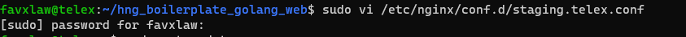
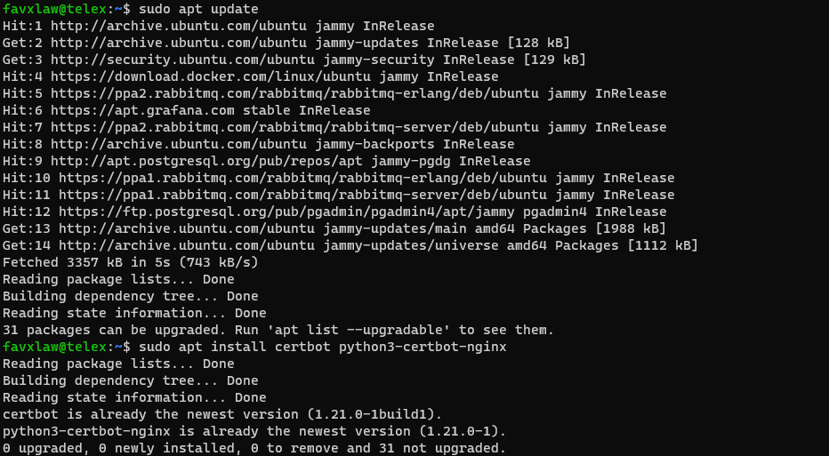
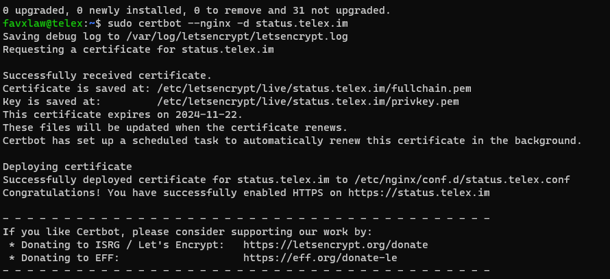
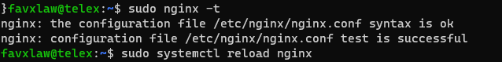

# A Documentation on Setting up Nginx Server Block with SSL for status.telex.im

## Overview

This document outlines the process of creating an Nginx server block for `status.telex.im` and securing it with SSL using Certbot.

## Prerequisites

- Ubuntu or Debian-based system
- Nginx installed
- Root or sudo access

## Steps

### 1. Create Nginx Server Block Configuration

Create a new configuration file in the Nginx `conf.d` directory:

```
sudo nano /etc/nginx/conf.d/status.telex.conf
```

Add the following content to the file

```
server {
    server_name status.telex.im;

    location / {
        alias /home/vicradon/deployments/cypress-report/telex-fe;
        index index.html;
        try_files $uri $uri/ =404;
    }
}
```

Then save and exit the editor



### 2. Install Certbot
If Certbot is not already installed, install it using the following commands:
`sudo apt update`

`sudo apt install certbot python3-certbot-nginx`



### 3. Generate SSL Certificate
Use Certbot to generate an SSL certificate for the domain:

`sudo certbot --nginx -d status.telex.im`

Follow the prompts to complete the SSL setup.



### 4. Verify Configuration
After Certbot modifies the configuration, you can verify the changes:
`sudo cat /etc/nginx/conf.d/status.telex.conf`

### 5. Test Nginx Configuration
Ensure the Nginx configuration is valid:
`sudo nginx -t`

### 6. Reload Nginx
If the test is successful, reload Nginx to apply the changes:
`sudo systemctl reload nginx`



## Conclusion
Your `status.telex.im` site should now be accessible over HTTPS with a valid SSL certificate.